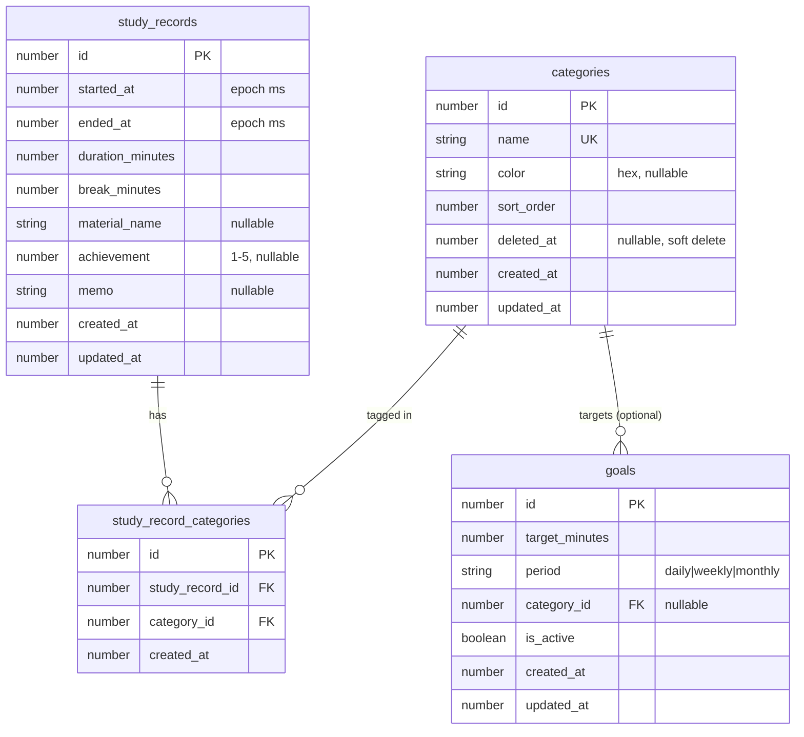

# ER 図

勉強記録アプリのテーブル関連図（Mermaid 形式）。

## 全体図

## 関連の説明

### `study_records` ⇔ `categories`（多対多）

- 1 つの学習記録には **0 個以上のカテゴリ** が付与される
- 1 つのカテゴリは **0 個以上の学習記録** に紐づく
- 中間テーブル `study_record_categories` を介して関連を表現

### `categories` → `goals`（1対多、任意）

- 1 つのカテゴリに対して **0 個以上の目標** が設定される
- `goals.category_id` が null の場合は **全体目標**（特定カテゴリに紐づかない）

## カーディナリティ早見表

| 親 | 子 | カーディナリティ | 備考 |
|---|---|---|---|
| `study_records` | `study_record_categories` | 1 : 0..N | 学習記録削除時はカスケード削除（アプリ層で実装） |
| `categories` | `study_record_categories` | 1 : 0..N | カテゴリ削除時の挙動は要検討（暫定：論理削除で関連は維持） |
| `categories` | `goals` | 1 : 0..N | `category_id` が null の goals は全体目標 |

## 注意事項

- IndexedDB には外部キー制約がないため、参照整合性は **すべてアプリ層で担保** する
- カスケード削除も自動では行われないため、削除処理時に関連レコードを明示的に削除する必要がある
