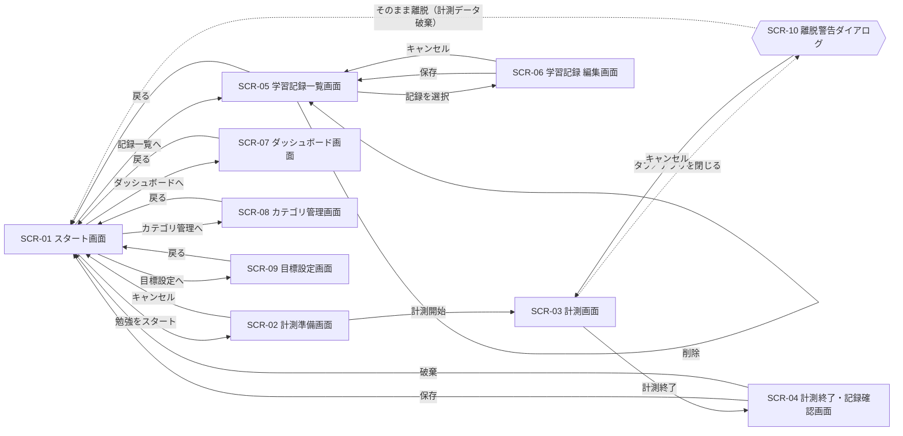

# 画面遷移図

```mermaid
flowchart LR
    SCR01[SCR-01 スタート画面]
    SCR02[SCR-02 計測準備画面]
    SCR03[SCR-03 計測画面]
    SCR04[SCR-04 計測終了・記録確認画面]
    SCR05[SCR-05 学習記録一覧画面]
    SCR06[SCR-06 学習記録 編集画面]
    SCR07[SCR-07 ダッシュボード画面]
    SCR08[SCR-08 カテゴリ管理画面]
    SCR09[SCR-09 目標設定画面]
    SCR10{{SCR-10 離脱警告ダイアログ}}

    SCR01 -->|勉強をスタート| SCR02
    SCR01 -->|記録一覧へ| SCR05
    SCR01 -->|ダッシュボードへ| SCR07
    SCR01 -->|カテゴリ管理へ| SCR08
    SCR01 -->|目標設定へ| SCR09

    SCR02 -->|計測開始| SCR03
    SCR02 -->|キャンセル| SCR01

    SCR03 -->|計測終了| SCR04
    SCR03 -.->|タブ／アプリを閉じる| SCR10
    SCR10 -->|キャンセル| SCR03
    SCR10 -.->|そのまま離脱（計測データ破棄）| SCR01

    SCR04 -->|保存| SCR01
    SCR04 -->|破棄| SCR01

    SCR05 -->|記録を選択| SCR06
    SCR05 -->|削除| SCR05
    SCR05 -->|戻る| SCR01

    SCR06 -->|保存| SCR05
    SCR06 -->|キャンセル| SCR05

    SCR07 -->|戻る| SCR01
    SCR08 -->|戻る| SCR01
    SCR09 -->|戻る| SCR01
```

## 凡例

- 実線矢印：通常のユーザー操作による遷移
- 点線矢印：ブラウザ／システム起因のイベント（タブを閉じる等）
- ひし形ノード（`{{ }}`）：ダイアログ／モーダル
